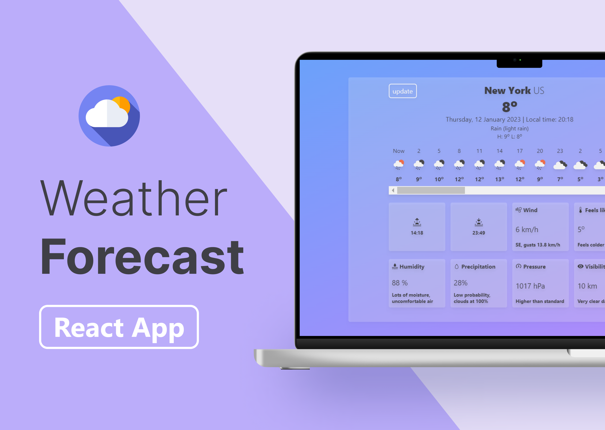

<h1 align="center">Hi there, I'm <a href="https://www.linkedin.com/in/mariia-datsenko-47a58b21b/" target="_blank">Mariia</a> 
</h1>
<h3 align="center">FullStack Developer from Ukraine</h3>
<h4 align="center">This is a code repository for the <a href="https://iam-datsenko.github.io/react_weather/" target="_blank">Weather Forecast App</a>, enjoy!</h4>

<h1 align="center">Local development</h3>
<h3>Core</h3>
<ul>
  <li>ReactJS</li>
  <li>TypeScript</li>
  <li>TailwindCSS</li>
</ul>

<h3>Installing</h3>
<ul>
  <li>Fork and clone this repository</li>
  <li>Run `npm install` in your terminal</li>
  <li>Run `npm start`</li>
</ul>
